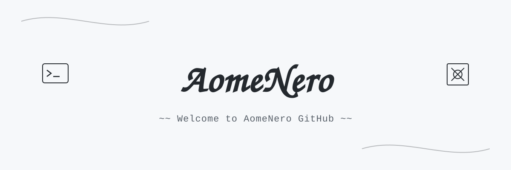

<h1 align="center">
  
</h1>

  <i>"执念散尽皆释然，轻舟已过万重山。"</i>

## 欢迎你的到来！

我是全栈 / AI 软件开发工程师 ，专注于 AI Agent、RAG、LLM 应用开发，欢迎大家一起交流。

## Skills

         
       
    
       
    

## Project

- [AomeRAG](https://github.com/AomeNero/AomeRAG) - 公司 & 个人私域知识库的 Agentic RAG 系统
- [learn-agent-code](https://github.com/AomeNero/learn-agent-code)  - 学习 Agent 开发
- [Iris](https://github.com/AomeNero/Iris) - Windows 极速桌面启动器 —— 快捷键秒搜文件、应用与书签
- [sokit](https://github.com/AomeNero/sokit) - 简单、高效的跨平台 TCP/UDP 网络调试工具
- [DSI-Calculation](https://github.com/AomeNero/DSI-Calculation) -  JC 显示接口信号速率计算器
- a lot more ;)

## Contact

 https://x.com/NeroAck 
 yotianya@gmail.com 
 https://www.aomenero.com 
 https://t.me/AomeNero 
 
